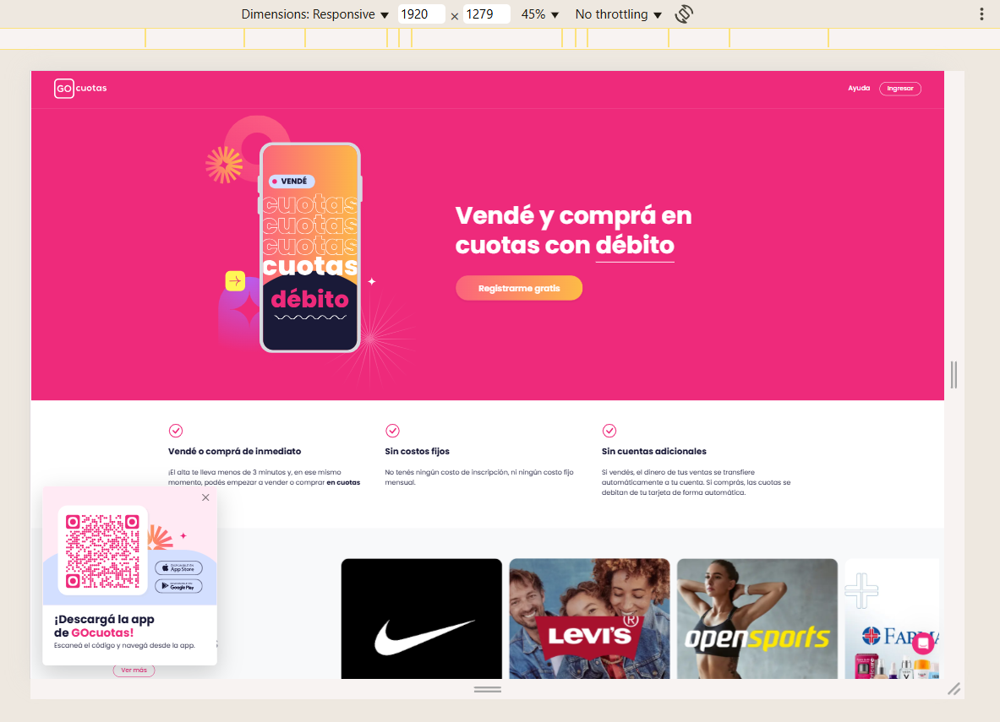

## Caso de prueba Nº05: Compatibilidad entre navegadores y dispositivos

**ID:** TC-GC-005  
**Prioridad:** Alta  
**Funcionalidad:** Compatibilidad y diseño responsivo  
**Tipo de prueba:** Cross-browser / Responsiva

---

**🎯 Objetivo:**  
Verificar que el sitio **GoCuotas** se visualice y funcione correctamente en distintos navegadores y tamaños de pantalla comunes (desktop, tablet, móvil).

---

**🔧 Precondiciones:**
- Acceso a los navegadores: Chrome, Edge, Brave
- Conexión estable a Internet
- Herramientas DevTools.

---

**🧪 Pasos para ejecutar:**
1. Abrir la página https://www.gocuotas.com en Chrome (versión estable).
2. Repetir el acceso en Edge y Brave.
3. En cada navegador, probar las siguientes resoluciones:
   - Desktop: 1920x1080
   - Laptop: 1366x768
   - Tablet: 1024x768
   - Móvil: 375x667 (iPhone 8) y 414x896 (iPhone 11 Pro Max)
4. Verificar:
   - Que los menús, banners y formularios se visualicen correctamente
   - Que no haya elementos desalineados, cortados o invisibles
   - Que los textos sean legibles en todos los dispositivos
   - Que el menú responsive funcione correctamente en móvil

---

**✅ Resultado esperado:**
- El sitio se adapta correctamente a todas las resoluciones definidas
- No hay errores visuales ni elementos cortados
- Los formularios, botones y links son usables en todas las vistas

---

**📌 Resultado obtenido:**  
- El sitio se visualiza correctamente en todos los navegadores probados, salvo un leve desborde horizontal en Firefox móvil a 375px.

---

**📎 Evidencia:**  
- Captura de cada resolución y navegador:  
  - 
  - 

---

**📝 Observaciones:**
- En resolución 375px, se detectó un **scroll lateral inesperado** en Firefox. Se recomienda revisar `overflow-x` en estilos globales.
